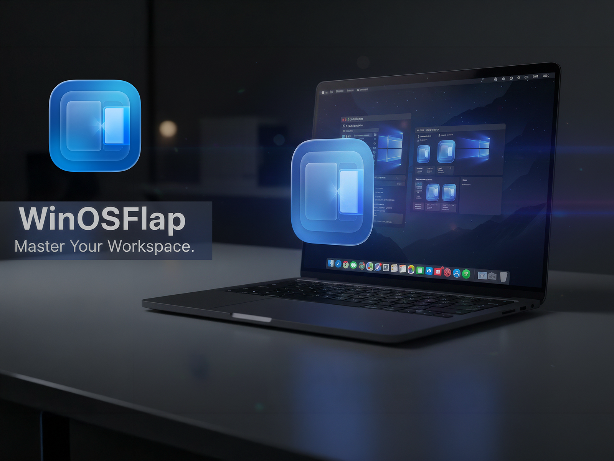

#  WinOSFlap: Professional Window Manager

   
  
  
  
    
  
<b>✅ Store Approved! WinOSFlap is now officially available for download.</b>

   

**Master your workspace with the ultimate window tiling tool for macOS. Fast, intuitive, and powerful.**

Tired of manually resizing windows? **WinOSFlap** brings professional-grade window management to your Mac. Snap windows into place, create perfect split-screens, and boost your productivity with seamless interactions.

---

## 🚀 Get WinOSFlap (Full Version)

Purchase the full version to unlock all features and support the development of high-quality macOS utilities. 

### 👉 [Buy WinOSFlap on Lemon Squeezy](https://maxapp.lemonsqueezy.com/checkout/buy/ad33a567-1d41-4048-a4fa-b31564f25492)

*🛡️ **Safe & Secure:** WinOSFlap is fully **Apple Notarized**. This means the app has been scanned and verified by Apple to be free of malicious software.*

---

## ✨ Key Features
* **Apple Notarized:** Verified and signed by Apple for a secure and seamless installation on macOS.
* **Smart Snap Zones:** Drag windows to screen edges for instant tiling and resizing.
* **Custom Shortcuts:** Manage your entire workspace without ever leaving the keyboard.
* **Lightweight Performance:** Optimized to run silently in the background with near-zero CPU usage.
* **Privacy Focused:** Runs locally on your machine. No data collection, no internet required.

---

## 🐛 Feedback & Bug Reports
Found a bug or have a feature request? Help us make **WinOSFlap** the best it can be!

1.  Go to the **Issues** tab above.
2.  Click **New Issue**.
3.  Let us know what you think!

---
*Developed with ❤️ by MaxApp (Xideaa)*
