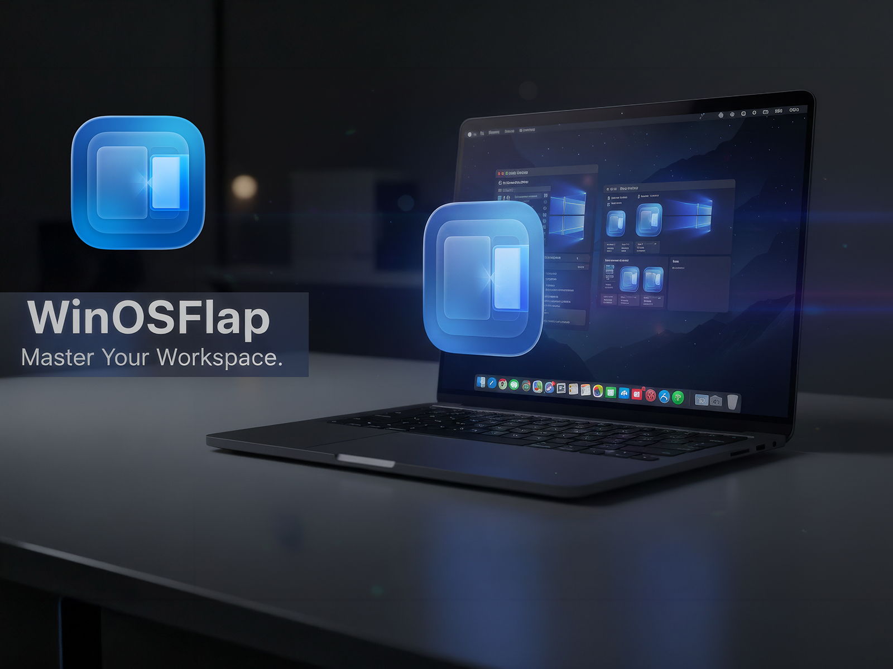

#  WinOSFlap – Professional Window Manager for macOS

 

  

<b>🎉 WinOSFlap is completely FREE and open-source.</b>

Download it, use it, and help improve it by sharing your feedback!

---

## 🖥 Professional Window Management for macOS

**WinOSFlap** is a lightweight window manager that helps you organize your workspace with fast and intuitive window snapping.

Create perfect layouts, improve multitasking, and boost your productivity without slowing down your Mac.

---

# 🚀 Download

Download the latest version from the **Releases** section.

👉 https://github.com/aturkoz/WinOSFlap/releases/latest

---

# ✨ Features

- 🪟 Smart Window Snapping
- ⌨️ Custom Keyboard Shortcuts
- ⚡ Lightweight & Fast
- 🍎 Native macOS Experience
- 🔒 Runs Completely Offline
- 🛡 Apple Notarized
- 🚀 Optimized for Productivity

---

---

# ❤️ Support

If WinOSFlap improves your workflow, you can support the project by:

⭐ Starring this repository

🐞 Reporting bugs

💡 Suggesting new features

📺 Sharing the project with other Mac users

Every Star helps the project grow!

---

# 🐛 Feedback & Bug Reports

Found a bug or have an idea?

1. Open the **Issues** tab.
2. Click **New Issue**.
3. Describe the problem or your suggestion.

Every report helps improve WinOSFlap.

---

# 📄 License

This project is released under the **MIT License**.

---

Made with ❤️ by **Ahmet Türköz**

